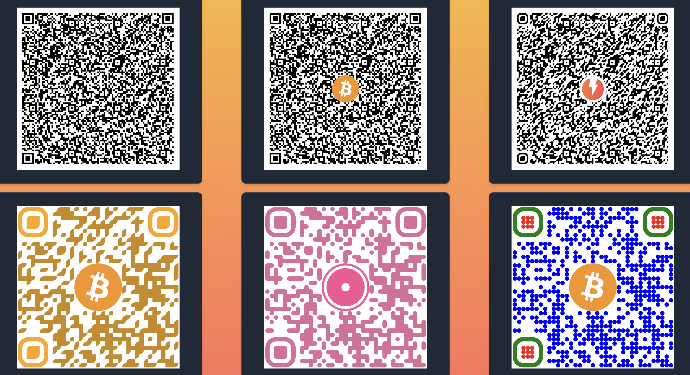

# `<bitcoin-qr />`

[](https://choosealicense.com/licenses/mit/)
[](https://npmjs.org/package/bitcoin-qr)
[](https://www.npmjs.com/package/package-name)

A zero-dependency, zero-framework QR code [web component](https://developer.mozilla.org/en-US/docs/Web/API/Web_Components) for Bitcoin on-chain, Lightning, and [unified BIP-21](https://bitcoinqr.dev/) payments.

PRs and suggestions welcome!

<p float="left">

</p>

## Table of Contents

- [`<bitcoin-qr />`](#bitcoin-qr-)
  - [Table of Contents](#table-of-contents)
  - [Features](#features)
  - [Background](#background)
  - [Installation](#installation)
      - [CDN](#cdn)
      - [NPM](#npm)
  - [Usage](#usage)
      - [More Examples](#more-examples)
  - [API Reference](#api-reference)
      - [Base attributes:](#base-attributes)
      - [Callback](#callback)
      - [Styles and Other Options](#styles-and-other-options)
  - [Roadmap](#roadmap)
  - [Run Locally](#run-locally)
  - [License](#license)

## Features

- [x] URI support for Lightning, on-chain, BIP-21
- [x] Poll for payment
- [x] Customizable styles
- [x] WebLN support
- [x] Embed or overlay images

## Background

When developing a Bitcoin payment flow, there are multiple ways a user can expect to be able to pay. They might want to pay an on-chain address or Lightning invoice, they may be scanning a QR Code from their phone, copy/pasting from a wallet, or using a [WebLN](https://www.webln.guide/) browser extension. Creating an intuitive interface that also captures all the possible ways a user can pay is one of the fundamental UX challenges of developing an application that can receive payments in Bitcoin.

This flexibility opens up many [exciting use cases](https://brandonlucas.net/articles/bitcoin/micropayments), but often comes at the cost of being able to easily develop a smooth experience for the user. The greater the developer's cognitive load, the more difficult it is to create intuitive UX.

This project aims to provide everything needed to allow standard Bitcoin & Lightning Network payments out of the box. It handles creating the proper [URIs](https://github.com/bitcoin/bips/blob/master/bip-0021.mediawiki) from just an address or invoice, and favors creating unified URIs whenever possible. Styles are highly customizable and images can be embedded. It also includes polling functionality -- a callback can be passed as a property of the element to periodically check for payment.

See the [Roadmap](#roadmap)

## Installation

#### CDN

```html
<script type="module" src="https://unpkg.com/bitcoin-qr@1.4.1/dist/bitcoin-qr/bitcoin-qr.esm.js"></script>
```

#### NPM

```bash
yarn add bitcoin-qr
```

## Usage

To get the first image above:

HTML:

```html
<!doctype html>
<html lang="en">
  <head>
    <script type="module" src="https://unpkg.com/bitcoin-qr@1.4.1/dist/bitcoin-qr/bitcoin-qr.esm.js"></script>
  </head>
  <body>
    <bitcoin-qr
      id="qr"
      width="300"
      height="300"
      bitcoin="BC1QYLH3U67J673H6Y6ALV70M0PL2YZ53TZHVXGG7U"
      parameters="amount=0.00001&label=sbddesign%3A%20For%20lunch%20Tuesday&message=For%20lunch%20Tuesday"
      image="https://voltage.imgix.net/Team.png?fm=webp&w=160"
      type="svg"
      corners-square-color="#b23c05"
      corners-dot-color="#e24a04"
      corners-square-type="extra-rounded"
      dots-type="classy-rounded"
      dots-color="#ff5000"
    />
  </body>
</html>
```

Sveltekit:

```svelte
<script lang="ts">
  import { defineCustomElements } from 'bitcoin-qr/loader';

  defineCustomElements();
</script>

<bitcoin-qr
  id="qr"
  width="300"
  height="300"
  bitcoin="BC1QYLH3U67J673H6Y6ALV70M0PL2YZ53TZHVXGG7U"
  parameters="amount=0.00001&label=sbddesign%3A%20For%20lunch%20Tuesday&message=For%20lunch%20Tuesday"
  image="https://voltage.imgix.net/Team.png?fm=webp&w=160"
  is-polling="true"
  poll-interval="1000"
  type="svg"
  corners-square-color="#b23c05"
  corners-dot-color="#e24a04"
  corners-square-type="extra-rounded"
  dots-type="classy-rounded"
  dots-color="#ff5000"
/>
```

#### More Examples

- [HTML poll for payment (source)](./src/index.html)
- [Sveltekit (source)](./examples/sveltekit/)
- [Sveltekit kitchen sink (source)](./examples/sveltekit-kitchen-sink/)

## API Reference

#### Base attributes:

| Attribute        | Type      | Description                                                                                                                                                                            | Default | Example                                                                                                                                                                                                                                                                                                                                                                                                                                                             |
| :--------------- | :-------- | :------------------------------------------------------------------------------------------------------------------------------------------------------------------------------------- | :------ | :------------------------------------------------------------------------------------------------------------------------------------------------------------------------------------------------------------------------------------------------------------------------------------------------------------------------------------------------------------------------------------------------------------------------------------------------------------------ |
| `unified`        | `string`  | **Optional**. A [BIP-21](https://github.com/bitcoin/bips/blob/master/bip-0021.mediawiki) URI                                                                                           |         | bitcoin:BC1QYLH3U67J673H6Y6ALV70M0PL2YZ53TZHVXGG7U?amount=0.00001&label=sbddesign%3A%20For%20lunch%20Tuesday&message=For%20lunch%20Tuesday&lightning=LNBC10U1P3PJ257PP5YZTKWJCZ5FTL5LAXKAV23ZMZEKAW37ZK6KMV80PK4XAEV5QHTZ7QDPDWD3XGER9WD5KWM36YPRX7U3QD36KUCMGYP282ETNV3SHJCQZPGXQYZ5VQSP5USYC4LK9CHSFP53KVCNVQ456GANH60D89REYKDNGSMTJ6YW3NHVQ9QYYSSQJCEWM5CJWZ4A6RFJX77C490YCED6PEMK0UPKXHY89CMM7SCT66K8GNEANWYKZGDRWRFJE69H9U5U0W57RRCSYSAS7GADWMZXC8C6T0SPJAZUP6 |
| `bitcoin`        | `string`  | **Optional**. A bitcoin address                                                                                                                                                        |         | BC1QYLH3U67J673H6Y6ALV70M0PL2YZ53TZHVXGG7U                                                                                                                                                                                                                                                                                                                                                                                                                          |
| `lightning`      | `string`  | **Optional**. A Lightning invoice ([BOLT-11](https://github.com/lightning/bolts/blob/master/11-payment-encoding.md)) or offer ([BOLT-12](https://github.com/lightning/bolts/pull/798)) |         | LNBC10U1P3PJ257PP5YZTKWJCZ5FTL5LAXKAV23ZMZEKAW37ZK6KMV80PK4XAEV5QHTZ7QDPDWD3XGER9WD5KWM36YPRX7U3QD36KUCMGYP282ETNV3SHJCQZPGXQYZ5VQSP5USYC4LK9CHSFP53KVCNVQ456GANH60D89REYKDNGSMTJ6YW3NHVQ9QYYSSQJCEWM5CJWZ4A6RFJX77C490YCED6PEMK0UPKXHY89CMM7SCT66K8GNEANWYKZGDRWRFJE69H9U5U0W57RRCSYSAS7GADWMZXC8C6T0SPJAZUP6                                                                                                                                                      |
| `parameters`     | `string`  | **Optional**. A query string. Must be parseable by [URLSearchParams](https://developer.mozilla.org/en-US/docs/Web/API/URLSearchParams)                                                 |         | ?amount=0.00001&label=sbddesign%3A%20For%20lunch%20Tuesday&message=For%20lunch%20Tuesday                                                                                                                                                                                                                                                                                                                                                                            |
| `is-polling`     | `boolean` | **Optional**. A boolean value indicating whether the component should continue polling                                                                                                 | `false` |                                                                                                                                                                                                                                                                                                                                                                                                                                                                     |
| `poll-interval`  | `number`  | **Optional**. The frequency at which to poll in milliseconds                                                                                                                           | `5000`  |                                                                                                                                                                                                                                                                                                                                                                                                                                                                     |
| `debug`          | `boolean` | **Optional**. Enable debug mode                                                                                                                                                        | `false` |
| `image-embedded` | `boolean` | **Optional**. Specify if the image should be embedded within the QR code or overlayed on top. The larger the image overlay, the higher the qr-error-correction-level needed            | `false` |

At least one of `unified`, `bitcoin`, or `lightning` must be defined in order for the QR Code to render. All Bitcoin addresses and Lightning invoices will be prepended with `bitcoin:` and `lightning:` URIs, respectively. If both `bitcoin` and `lightning` are defined, a unified string of the format `bitcoin:<ADDRESS>?lightning=<INVOICE>` will be passed to the QR Code. If `unified` is defined, `bitcoin` and `lightning` are ignored. Whatever is passed to `parameters` will be appended to the unified string, whether it was provided via the `unified` attribute or created from the `bitcoin` & `lightning` params.

NOTE: There is currently no validation for the `unified`, `bitcoin`, `lightning`, or `parameters` fields. This is currently on the [roadmap](#roadmap). Validate what you're passing in!

#### Callback

`<bitcoin-qr />` can also be given a `callback` property which it will poll at a given `poll-interval`

```javascript
<script>
    async function checkPayment() {
        ...
    }

    const qr = document.getElementById('my-bitcoin-qr')
    qr.callback = checkPayment
</script>
```

#### Styles and Other Options

This component is built on top of [qr-code-styling](https://github.com/kozakdenys/qr-code-styling), refer to their documentation for more details on their [API](https://github.com/kozakdenys/qr-code-styling?tab=readme-ov-file#api-documentation), `<bitcoin-qr />` surfaces the majority of itand surfaces the majority of it:
| Attribute | Type | Description |
| :--------------------------- | :-------- | :------------------------------------------------------------------- |
| `width` | `number` | **Optional**. Width of the QR code. |
| `height` | `number` | **Optional**. Height of the QR code. |
| `type` | `string` | **Optional**. Type of QR code to draw. Options: `'canvas'`, `'svg'`. |
| `margin` | `number` | **Optional**. Margin around the QR code. |
| `image` | `string` | **Optional**. URL of the image to overlay on the QR code. |
| `shape` | `string` | **Optional**. Shape of the QR code. Options: `'square'`, `'circle'`. |
| `qr-type-number` | `number` | **Optional**. Type number of the QR code. |
| `qr-mode` | `string` | **Optional**. Mode of the QR code. Options: `'Numeric'`, `'Alphanumeric'`, `'Byte'`, `'Kanji'`. |
| `qr-error-correction-level` | `string` | **Optional**. Error correction level of the QR code. Options: `'L'`, `'M'`, `'Q'`, `'H'`. |
| `image-hide-background-dots` | `boolean` | **Optional**. Whether to hide background dots behind the image. |
| `image-size` | `number` | **Optional**. Size of the image overlay on the QR code. |
| `image-cross-origin` | `string` | **Optional**. Cross-origin setting for the image overlay. |
| `image-margin` | `number` | **Optional**. Margin around the image overlay. |
| `dots-type` | `string` | **Optional**. Type of dots. Options: `'square'`, `'dots'`, `'rounded'`, `'classy'`, `'classy-rounded'`, `'extra-rounded'`. |
| `dots-color` | `string` | **Optional**. Color of the dots. |
| `dots-rotation` | `number` | **Optional**. Rotation angle for dots. |
| `corners-square-type` | `string` | **Optional**. Type of corners for square. Options: `'square'`, `'extra-rounded'`, `'dot'`. |
| `corners-square-color` | `string` | **Optional**. Color of corners for square. |
| `corners-dot-type` | `string` | **Optional**. Type of corners for dot. Options: `'square'`, `'dot'`.|
| `corners-dot-color` | `string` | **Optional**. Color of corners for dot. |
| `background-round` | `number` | **Optional**. Rounding value for the background. |
| `background-color` | `string` | **Optional**. Color of the background. |

Currently, only `Gradient` styling options are not included.

## Roadmap

- [ ] Address, invoice, BIP-21, and parameter validation
- [ ] Add tests
- [ ] Optional copy (as opposed to URI)
- [ ] Add remaining [qr-code-styling](https://github.com/kozakdenys/qr-code-styling) properties (gradients)
- [ ] Add aria labels for accessibility
- [ ] Add [share](https://developer.mozilla.org/en-US/docs/Web/API/Navigator/share) button

## Run Locally

The project uses [Stencil.js](https://stenciljs.com/) for building the web component. To run the Stencil dev server:

```bash
yarn # install dependencies
yarn dev # opens at localhost:3333
```

## License

[MIT](https://choosealicense.com/licenses/mit/)
